# statedrift

**Git log for your infrastructure.** A tamper-evident agent that continuously snapshots host operational state, so you can diff any two points in time and hand auditors a cryptographically verifiable evidence bundle.

> v0.2 focuses on host-level operational state with optional collectors for CPU, kernel counters, processes, sockets, and NIC drivers. Future versions expand to security signals, filesystem diff, and fleet baselining — see [ROADMAP.md](ROADMAP.md).

## The problem

During an incident, nobody can agree on what the network config looked like before things broke. During an audit, your team spends weeks gathering screenshots and spreadsheets that auditors don't trust because files can be edited without detection. Configuration drift happens silently, and when you discover it, there's no record of when it started.

Statedrift solves this by recording what your infrastructure actually is — not just what it should be — with a tamper-evident hash chain that makes retroactive edits detectable.

## Install

```bash
curl -fsSL https://raw.githubusercontent.com/statedrift/statedrift/main/install.sh | bash
```

Linux only (amd64 and arm64). Requires `curl` (or `wget`), `tar`, and `sha256sum`. The installer pulls the [latest GitHub release](https://github.com/statedrift/statedrift/releases/latest), verifies its SHA-256 checksum, and installs to `/usr/local/bin`.

Pin a specific version, or install to a user-writable prefix without sudo:

```bash
curl -fsSL https://raw.githubusercontent.com/statedrift/statedrift/main/install.sh | bash -s -- --version 0.2.0
curl -fsSL https://raw.githubusercontent.com/statedrift/statedrift/main/install.sh | bash -s -- --prefix "$HOME/.local/bin"
```

To build from source instead:

```bash
make build
sudo cp bin/statedrift /usr/local/bin/
```

## Quick start

```bash
# Initialize the store (takes genesis snapshot)
sudo statedrift init

# Take a snapshot after making a change
sudo statedrift snap

# See what changed
statedrift diff HEAD~1 HEAD

# Verify the entire chain hasn't been tampered with
statedrift verify
```

### Optional: shell alias

`statedrift` is deliberately unambiguous in scripts and logs. For interactive use, add an alias to your shell profile:

```bash
# ~/.bashrc or ~/.zshrc
alias sd='statedrift'
```

If you're working with a non-default store path, bake it in:

```bash
alias sd='STATEDRIFT_STORE=/var/lib/statedrift statedrift'
```

> Note: `sd` is also the name of an unrelated find-and-replace tool. If you have both installed, choose a different alias name (e.g. `sdt`) to avoid the conflict.

## What gets captured

Every snapshot records:

| Section | What | Source |
|---------|------|--------|
| `host` | Hostname, OS, kernel version, uptime | `/proc/version`, `/etc/os-release` |
| `network.interfaces` | IPs, link state, MTU, packet counters | `/sys/class/net/` |
| `network.routes` | Routing table (destination, gateway, metric) | `/proc/net/route` |
| `network.dns` | Nameservers, search domains | `/etc/resolv.conf` |
| `kernel_params` | Selected sysctl values | `/proc/sys/` |
| `packages` | Installed package names and versions | `dpkg-query` or `rpm -qa` |
| `services` | Systemd unit names and states | `systemctl list-units` |
| `listening_ports` | TCP sockets in LISTEN state | `/proc/net/tcp` |

Each snapshot is SHA-256 hash-chained to the previous one. Modifying any snapshot breaks the chain — and `statedrift verify` catches it.

## What statedrift does NOT do

- Collect packet payloads or user content
- Modify any system state
- Require a cloud service or external dependency
- Replace your monitoring/observability stack

Statedrift is an **evidence tool**, not a monitoring tool. It answers: *"What was the state at time T, and can you prove it?"*

## Architecture

```
/proc, /sys, dpkg, systemctl, ip
            │
            ▼
    ┌──────────────────┐
    │ Snapshot Collector│  Reads, normalizes, canonicalizes
    └────────┬─────────┘
             │
             ▼
    ┌──────────────────┐
    │  Hash Chain Engine│  canonical JSON → SHA-256 → prev_hash link
    └────────┬─────────┘
             │
             ▼
    ┌──────────────────┐
    │  Append-Only Store│  /var/lib/statedrift/chain/YYYY-MM-DD/HHMMSS.json
    └────────┬─────────┘
             │
    ┌────┬───┴───┬────┬──────┐
    ▼    ▼       ▼    ▼      ▼
   log  show   diff verify export
                              │
                              ▼
                       Audit Bundle
                     (.tar.gz + verify.sh)
```



### Store layout

```
/var/lib/statedrift/
├── head                         # SHA-256 of latest snapshot
├── chain/
│   ├── 2026-03-22/
│   │   ├── 140000.json          # Snapshot at 14:00:00 UTC
│   │   ├── 150000.json
│   │   └── 160000.json
│   └── 2026-03-23/
│       └── 090000.json
└── exports/
```

## Command reference

### `statedrift init`

Initialize the snapshot store and take a genesis snapshot.

```bash
sudo statedrift init
```

Must be run once before any other command. Creates `/var/lib/statedrift/` (or `$STATEDRIFT_STORE`).

---

### `statedrift snap`

Take an on-demand snapshot.

```bash
sudo statedrift snap
```

Collects current host state, links it to the previous snapshot via hash chain, and writes it to the store. Prints a brief diff from the previous snapshot.

---

### `statedrift log`

Show snapshot history.

```bash
statedrift log
statedrift log --since 2026-03-01
statedrift log --since 2026-03-01 --until 2026-03-22
```

**Flags:**

| Flag | Description |
|------|-------------|
| `--since YYYY-MM-DD` | Show snapshots on or after this date |
| `--until YYYY-MM-DD` | Show snapshots on or before this date |
| `--json` | Output as JSON array |

---

### `statedrift show <ref>`

Display the full contents of a specific snapshot.

```bash
statedrift show a3f8c1d2          # by hash prefix
statedrift show HEAD              # latest snapshot
statedrift show HEAD~1            # one before latest
statedrift show HEAD~3            # three before latest
```

Prints all sections: network, routes, kernel params, listening ports, packages (top 20), services.

**Flags:**

| Flag | Description |
|------|-------------|
| `--json` | Output raw snapshot JSON |

---

### `statedrift diff <a> <b>`

Compare two snapshots.

```bash
statedrift diff HEAD~1 HEAD                          # last change
statedrift diff a3f8 f7a2                            # by hash prefix
statedrift diff HEAD~1 HEAD --section kernel_params  # one section only
statedrift diff HEAD~1 HEAD --material-only          # skip counter noise
statedrift diff HEAD~1 HEAD --json                   # machine-readable
```

Output symbols: `+` added, `-` removed, `~` modified. Counter-type changes (packet counts, etc.) are shown dimmed and excluded from the material-change count.

**Flags:**

| Flag | Description |
|------|-------------|
| `--section <name>` | Limit to one section: `network`, `kernel_params`, `packages`, `services`, `listening_ports`, `host` |
| `--material-only` | Hide counter changes |
| `--json` | Output diff result as JSON |
| `--no-color` | Disable ANSI colors |

---

### `statedrift verify [bundle.tar.gz]`

Validate hash chain integrity.

```bash
statedrift verify                        # verify local store
statedrift verify audit-2026-03.tar.gz   # verify an export bundle
```

Walks the entire chain, recomputes every hash, and reports the first broken link (if any). Exit code 0 = verified, 1 = violation detected.

---

### `statedrift export`

Create a verifiable evidence bundle.

```bash
statedrift export --from 2026-03-01 --to 2026-03-22 -o audit.tar.gz
```

The bundle is a `.tar.gz` containing:
- All snapshot JSON files for the date range
- `manifest.json` with metadata and chain verification status
- `verify.sh` — self-contained verification script (requires only `sha256sum` + `jq`)
- `README.txt` — instructions for auditors

**Flags:**

| Flag | Description |
|------|-------------|
| `--from YYYY-MM-DD` | Start date (inclusive) |
| `--to YYYY-MM-DD` | End date (inclusive) |
| `-o, --output <file>` | Output filename (default: `statedrift-export-FROM-TO.tar.gz`) |

---

### `statedrift daemon`

Run continuous snapshot collection.

```bash
sudo statedrift daemon                    # use interval from config (default: 1h)
sudo statedrift daemon --interval 15m    # custom interval
sudo statedrift daemon --install         # generate systemd service file
```

Takes a snapshot immediately on start, then on each tick. Handles `SIGTERM`/`SIGINT` by stopping gracefully. Logs one line per snapshot to stdout.

**Flags:**

| Flag | Description |
|------|-------------|
| `--interval <duration>` | Snapshot interval, e.g. `30s`, `15m`, `1h` (sub-minute allowed for testing) |
| `--install` | Write `/etc/systemd/system/statedrift.service` and print activation instructions |

---

### `statedrift watch`

Continuously snap and alert on material changes. Unlike `daemon`, `watch` diffs each new snapshot against the previous one and surfaces material changes — to stdout, and optionally to a webhook (Slack-compatible JSON POST).

```bash
statedrift watch                                      # 5m interval, stdout only
statedrift watch --interval 1m --material-only        # ignore counter-only changes
statedrift watch --webhook https://hooks.slack.com/services/...
```

**Flags:**

| Flag | Description |
|------|-------------|
| `--interval <duration>` | Snapshot interval, e.g. `1m`, `5m`, `15m` (default: `5m`, min: `1m`) |
| `--webhook <url>` | HTTP POST diff JSON to this URL on every material change |
| `--material-only` | Suppress counter-only changes (CPU ticks, packet counts, etc.) |
| `--json` | Emit diff events as JSON to stdout |

`watch` enforces `retention_days` automatically after every snapshot, so the store does not grow unboundedly at tight intervals.

`watch` honours `section_intervals` in the config — different collectors can run at different cadences (e.g. interfaces every 1m, packages every 1h). See [docs/CONFIGURATION.md](docs/CONFIGURATION.md). `daemon` always does a full collect on every tick.

---

### `daemon` vs `watch` — which do I want?

| | `daemon` | `watch` |
|--|---------|---------|
| **Purpose** | Silent archival — build the chain | Real-time alerting on the chain |
| **Default interval** | 1h | 5m |
| **Per-tick work** | Collect + store | Collect + store + diff + alert |
| **Stdout** | One line per snapshot (timestamp + hash) | Full material-change diffs |
| **Webhook** | No | Yes (`--webhook`) |
| **systemd** | `--install` / `--uninstall` | Run under your own supervisor |
| **Per-section intervals** | No | Yes (`section_intervals` in config) |
| **Sub-minute intervals** | Allowed (for demos/tests) | Rejected (1m floor) |

You can run **both** on the same host: `daemon` for the long-term hash-chained archive at 1h, `watch` at 5m for live alerting. They share the same store; both append to the same chain.

---

### `statedrift gc`

Remove snapshots older than `retention_days` (from config, default 365).

```bash
sudo statedrift gc
```

Re-links the hash chain after deletion so `verify` still passes on the remaining snapshots.

---

### `statedrift version`

Print the binary version.

```bash
statedrift version
```

---

### `statedrift help <command>`

Print detailed help for a command.

```bash
statedrift help snap
statedrift help diff
statedrift help export
```

---

## Configuration

Statedrift reads `/etc/statedrift/config.json` on startup (override with `STATEDRIFT_CONFIG=/path/to/config.json`). All fields are optional — defaults apply when the file is absent.

```json
{
  "store_path": "/var/lib/statedrift",
  "interval": "1h",
  "retention_days": 365,
  "kernel_params": [
    "net.ipv4.ip_forward",
    "net.core.somaxconn"
  ],
  "capture": [
    "host", "network", "kernel_params",
    "packages", "services", "listening_ports"
  ],
  "ignore": {
    "interfaces": ["docker0", "veth*", "br-*"],
    "packages": []
  }
}
```

See [docs/CONFIGURATION.md](docs/CONFIGURATION.md) for the complete reference.

## Environment variables

| Variable | Description |
|----------|-------------|
| `STATEDRIFT_STORE` | Override store path (default: `/var/lib/statedrift`) |
| `STATEDRIFT_CONFIG` | Override config file path (default: `/etc/statedrift/config.json`) |
| `NO_COLOR` | Set to any value to disable ANSI color output |

## How it works with Chef / Ansible / Puppet

**Chef tells your infrastructure what it should be. Statedrift records what it actually is.**

They're complementary:

- Chef enforces desired state → statedrift independently proves actual state
- Chef can't tell you what happened between runs → statedrift has the snapshot
- Chef's logs can be modified → statedrift's hash chain makes tampering detectable

Together, you get **verified compliance**: proof that your desired state and actual state matched, backed by cryptographic evidence.

## Security model

Statedrift assumes the host may be compromised and aims to make tampering **detectable**, not impossible.

- Modifying any snapshot file → breaks the hash chain → caught by `verify`
- Deleting a snapshot → breaks the chain → caught
- Adding a snapshot between two existing ones → breaks the chain → caught
- The export bundle locks in the chain state at creation time

For stronger guarantees:
- Set the chain directory append-only: `chattr +a /var/lib/statedrift/chain/`
- Ship export bundles to an external, write-once storage location promptly
- A future version will support external timestamping (posting head hashes to a transparency log)

See [docs/SECURITY.md](docs/SECURITY.md) for the full threat model. For
the design rationale (architecture, data model, hash chain mechanics,
identifier inventory), see [docs/DESIGN.md](docs/DESIGN.md).

## FAQ

**Is this a monitoring tool?**
No. Statedrift doesn't alert, graph, or aggregate metrics. It's an evidence tool — it creates a cryptographically verifiable record of what your infrastructure looked like at each point in time.

**Does it need root?**
`snap`, `init`, and `daemon` need root to read some `/proc` and `/sys` paths and to query the package database. `log`, `show`, `diff`, `verify`, and `export` work as any user who can read `/var/lib/statedrift/`.

**How much disk does it use?**
Each snapshot is typically 50–200 KB (compressed). At one snapshot per hour, that's ~1.5 MB/day, ~550 MB/year. Adjust `retention_days` in config.

**Can I use it in containers?**
Yes. Sections that aren't available (e.g., systemd services, some sysctl paths) produce empty collections rather than errors. A `collector_errors` field in each snapshot records what was skipped.

**Can I query snapshots programmatically?**
Yes. Use `--json` flags on `log`, `show`, and `diff` for machine-readable output. Each snapshot is a plain JSON file in `/var/lib/statedrift/chain/`.

**What's the minimum verification environment?**
An auditor needs only `sha256sum` and `jq` to run `verify.sh` from an export bundle — no Go toolchain, no statedrift binary required.

**Will statedrift track more than host state?**
The current release captures host-level infrastructure state — the operational signals that matter most for incident response and compliance. v0.3 expands this with security signals (users, groups, SSH keys, kernel modules, cron, mounts), and later versions add filesystem diff, fleet baselining, and container runtime state. See [ROADMAP.md](ROADMAP.md) for the full plan, or open an issue to tell us what matters to you.

## Contributing

### Build

```bash
git clone https://github.com/statedrift/statedrift
cd statedrift
make build          # produces bin/statedrift
make test           # runs unit tests
make vet            # runs go vet
make release        # cross-compiles and packages dist/ archives
```

### Rules

- Pure Go, stdlib only — no external dependencies
- `go vet ./...` and `go test ./...` must pass after every change
- `gofmt -w .` before committing
- Do not modify the snapshot JSON schema without updating tests

### Testing

```bash
go test ./...                      # unit tests
go test -tags integration ./...    # integration tests (requires root for some)
```

## License

MIT — see [LICENSE](LICENSE).
