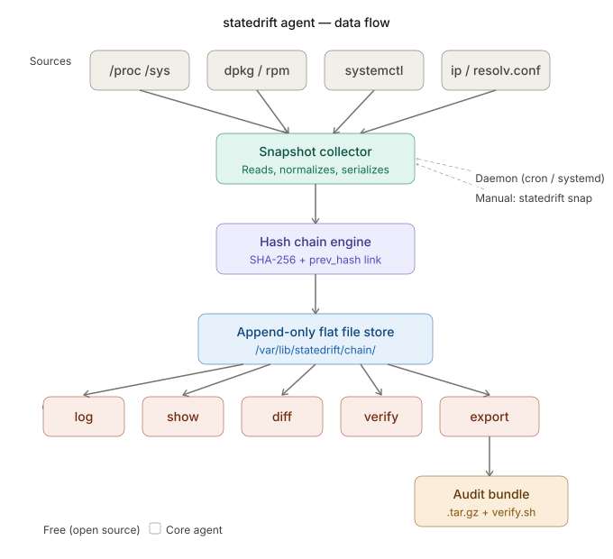

# statedrift

**Git log for your infrastructure.** A single Go binary that snapshots what your Linux hosts *actually are* — network, packages, services, users, sudoers, kernel modules, mounts, firewall, containers, GPUs, and more — into a tamper-evident hash chain. Diff any two points in time, and hand auditors a cryptographically verifiable evidence bundle.

[](https://github.com/statedrift/statedrift/releases/latest)
[](https://github.com/statedrift/statedrift/actions/workflows/test.yml)
[](LICENSE)
[](https://github.com/statedrift/statedrift/releases)

Linux · single static binary · no daemon required · no cloud · zero third-party dependencies.

## See it work


<!-- The console transcript below is the accessible / copy-paste fallback for the
     GIF above; it mirrors the tape's real command output. Re-render both with
     demo/run-demo.sh (VHS) and keep them in sync. -->

```console
$ sudo statedrift init
✓ Store initialized at /var/lib/statedrift/chain
✓ Genesis snapshot recorded
✓ Run 'statedrift snap' to take more snapshots.

# ...an hour later, something changed on the box. Snapshot again:
$ sudo statedrift snap
✓ Snapshot recorded

# What actually changed?
$ statedrift diff HEAD~1 HEAD
Comparing 2026-06-30 14:00 → 2026-06-30 15:00

  kernel_params:
  ~ net.ipv4.ip_forward: "0" → "1"

  users:
  + backdoor: uid=1001 gid=1001 shell=/bin/bash

2 material changes, 0 counter increments
```

Someone turned the host into a router and gave themselves an account — surfaced in plain sight, with a timestamped record of exactly when it happened.

A diff lists *everything* that changed. `analyze` runs the built-in rule engine over that diff and tells you which of those changes are dangerous, and how severe:

```console
$ statedrift analyze
statedrift analyze — 2026-06-30T14:00:00Z → 2026-06-30T15:00:00Z
  2 material changes, 54 rules evaluated

  [HIGH] Kernel parameter changed (1 match)
    A sysctl value was changed. Security-relevant params (ip_forward, rp_filter) are high severity.
  [HIGH] New user account (1 match)
    A new entry was added to /etc/passwd. New accounts created outside a change window may be backdoors.

2 finding(s). Run 'statedrift diff HEAD~1 HEAD' for full details.
  Pro rules skipped (no license). See 'statedrift help analyze'.
```

And because every snapshot is SHA-256 hash-chained to the one before it, nobody can quietly rewrite history to cover their tracks — `verify` catches an edited snapshot:

```console
$ statedrift verify
Verifying chain integrity...
  Snapshots:  3
  Chain:      ✓ all 3 hashes valid
  Head:       ✓ matches last snapshot
  Result:     INTEGRITY VERIFIED

No tampering detected. All snapshots are consistent with their recorded hashes.

# ...but if an attacker edits an old snapshot to erase the evidence:
$ statedrift verify
Verifying chain integrity...
  Snapshots:  3
  Chain:      ✗ BREAK at snapshot #1 (2026-06-30T15:00:00Z)
              Expected prev_hash: a3f81c2d9e4b5f6a...
              Found prev_hash:    7c0091a2bd34ef58...
  Result:     INTEGRITY VIOLATION
```

## The problem

During an incident, nobody can agree on what the config looked like *before* things broke. During an audit, your team burns weeks on screenshots and spreadsheets that auditors don't trust — because files can be edited without a trace. Drift happens silently, and by the time you find it, there's no record of when it started.

statedrift records what your infrastructure *actually is* — not what it's supposed to be — in a tamper-evident hash chain that makes retroactive edits detectable.

## Install

```bash
curl -fsSL https://raw.githubusercontent.com/statedrift/statedrift/main/install.sh | bash
```

Linux only (amd64 and arm64). Needs `curl` (or `wget`), `tar`, and `sha256sum`. The installer pulls the [latest release](https://github.com/statedrift/statedrift/releases/latest), verifies its SHA-256 checksum, and installs to `/usr/local/bin`.

Pin a version, or install without sudo to a user-writable prefix:

```bash
curl -fsSL https://raw.githubusercontent.com/statedrift/statedrift/main/install.sh | bash -s -- --version 0.8.1
curl -fsSL https://raw.githubusercontent.com/statedrift/statedrift/main/install.sh | bash -s -- --prefix "$HOME/.local/bin"
```

Or build from source (Go, no external dependencies):

```bash
make build && sudo cp bin/statedrift /usr/local/bin/
```

## Quick start — 60 seconds to your first drift catch

```bash
sudo statedrift init          # record the genesis snapshot (chain root)
sudo statedrift snap          # ...later, snapshot again after any change
sudo statedrift diff HEAD~1 HEAD   # see exactly what changed
sudo statedrift verify             # prove the whole chain is untampered
```

Prefer to try it without root? Use a home-directory store — then no command needs sudo:

```bash
export STATEDRIFT_STORE=$HOME/.statedrift
statedrift init && statedrift snap
```

That's the loop. Run `snap` on a schedule (cron, or the built-in `statedrift watch`) and you've got a continuous, verifiable record of everything your host is. Want more than the core sections? Optional collectors (containers, GPUs, your AI agent's config, ...) are one command away:

```bash
sudo statedrift config enable containers   # or: gpu, dataplane, harness, ... or all
```

See [what gets captured](#what-gets-captured) below, or `statedrift --help` for every command.

### Optional: shell alias

`statedrift` is deliberately unambiguous in scripts and logs. For interactive use, add an alias to your shell profile:

```bash
# ~/.bashrc or ~/.zshrc
alias sd='statedrift'
```

If you're working with a non-default store path, bake it in:

```bash
alias sd='STATEDRIFT_STORE=/var/lib/statedrift statedrift'
```

> Note: `sd` is also the name of an unrelated find-and-replace tool. If you have both installed, choose a different alias name (e.g. `sdt`) to avoid the conflict.

## What gets captured

Every snapshot records:

| Section | What | Source |
|---------|------|--------|
| `host` | Hostname, OS, kernel version, uptime | `/proc/version`, `/etc/os-release` |
| `network.interfaces` | IPs, link state, MTU, packet counters | `/sys/class/net/` |
| `network.routes` | Routing table (destination, gateway, metric) | `/proc/net/route` |
| `network.dns` | Nameservers, search domains | `/etc/resolv.conf` |
| `kernel_params` | Selected sysctl values | `/proc/sys/` |
| `packages` | Installed package names and versions | `dpkg-query` or `rpm -qa` |
| `services` | Systemd unit names and states | `systemctl list-units` |
| `listening_ports` | TCP sockets in LISTEN state | `/proc/net/tcp` |
| `mac` | SELinux/AppArmor enforcement mode and policy | `/sys/fs/selinux`, `/sys/kernel/security/apparmor` |
| `firewall` | Packet-filter ruleset identity (SHA-256 + rule count) plus the parsed per-rule list for added/removed/reordered diff (rules embed IPs/ports — redacted by `--redact-network`) | `nft list ruleset`, `iptables-save` |

Opt-in collectors extend the snapshot further. Enable one with `statedrift config enable <name>` (or `enable all` for everything); all are free and daemon-free, like everything else:

| Collector | What | Drift it catches |
|-----------|------|------------------|
| `cpu`, `kernel_counters` | CPU mode ticks; IP/TCP/UDP protocol counters | Load and traffic anomalies (tracked as counters, never material drift) |
| `processes` | Top-N processes by memory | A resident process that wasn't there before |
| `sockets` | Socket inventory per process | A process quietly opening new connections |
| `nic_drivers` | NIC driver and firmware versions (`ethtool -i`) | A swapped driver or firmware image |
| `filesystem` | Hash tree over configured roots (default `/etc`): per-file mode, ownership, size, SHA-256, plus a Merkle `root_hash` | Per-file content, permission, or ownership changes |
| `containers` | Running-container inventory from `/proc` cgroup membership — runtime-agnostic (Docker, containerd, CRI-O, podman) | A container appearing (R37), disappearing (R38), or turning privileged (R39) |
| `gpu` | NVIDIA GPU inventory from the driver's `/proc` interface | GPU added/removed, driver or VBIOS drift (R40–R43) |
| `dataplane` | SR-IOV VF counts and DPDK-bound NICs from `/sys` — devices handed to a userspace `vfio-pci`/`uio` driver, invisible to the kernel stack and its firewall | A NIC silently rebound to userspace, VF counts changing (R44–R47) |
| `harness` | Your AI agent's own config: Claude Code's `settings.json`, `.mcp.json`, and the user-scope `~/.claude.json` that `claude mcp add` writes to | A broadened tool permission, a new MCP server or hook, a model change (R49–R54) |

`filesystem` growth is bounded by size and file-count caps; file paths and hashes are stored as-is (system config paths, nothing sensitive). The `harness` collector never stores secrets — MCP env values and embedded credentials are dropped at collect time, keeping only key names and a redacted fingerprint (details in the box below).

> **Your AI coding agent's own config is attack surface — statedrift version-controls it.**
>
> An agent's permissions, MCP servers, and hooks decide what it's allowed to touch. A silently broadened tool permission or a newly wired-in MCP server is a real privilege change, and nothing else is watching that file. The `harness` collector snapshots it, so the change shows up in the diff and trips a rule:
>
> ```console
> $ statedrift config enable harness   # one-time opt-in (reads your ~/.claude — run as your own user)
> $ statedrift diff HEAD~1 HEAD --section harness
>   harness.mcp:
>   + ~/.claude.json filesystem: stdio      # a new MCP server was wired in → R50
> ```
>
> Secrets never enter the chain: MCP env values and credentials embedded in commands or URLs are dropped at collect time, leaving only env **key names** and a redacted SHA-256 fingerprint — so rotating a secret doesn't churn the snapshot, but changing the *wiring* does.

Each snapshot is SHA-256 hash-chained to the previous one. Modifying any snapshot breaks the chain — and `statedrift verify` catches it.

## What statedrift does NOT do

- Collect packet payloads or user content
- Modify any system state
- Require a cloud service or external dependency
- Replace your monitoring/observability stack

Statedrift is an **evidence tool**, not a monitoring tool. It answers: *"What was the state at time T, and can you prove it?"*

## Architecture

```
/proc, /sys, dpkg, systemctl, ip
            │
            ▼
    ┌──────────────────┐
    │ Snapshot Collector│  Reads, normalizes, canonicalizes
    └────────┬─────────┘
             │
             ▼
    ┌──────────────────┐
    │  Hash Chain Engine│  canonical JSON → SHA-256 → prev_hash link
    └────────┬─────────┘
             │
             ▼
    ┌──────────────────┐
    │  Append-Only Store│  /var/lib/statedrift/chain/YYYY-MM-DD/HHMMSS.json
    └────────┬─────────┘
             │
    ┌────┬───┴───┬────┬──────┐
    ▼    ▼       ▼    ▼      ▼
   log  show   diff verify export
                              │
                              ▼
                       Audit Bundle
                     (.tar.gz + verify.sh)
```



### Store layout

```
/var/lib/statedrift/
├── head                         # SHA-256 of latest snapshot
├── baseline.json                # Optional pinned compliance reference
├── chain/
│   ├── 2026-03-22/
│   │   ├── 140000.json          # Snapshot at 14:00:00 UTC
│   │   ├── 150000.json
│   │   └── 160000.json
│   └── 2026-03-23/
│       └── 090000.json
└── exports/
```

## Command reference

### `statedrift init`

Initialize the snapshot store and take a genesis snapshot.

```bash
sudo statedrift init
```

Must be run once before any other command. Creates `/var/lib/statedrift/` (or `$STATEDRIFT_STORE`).

---

### `statedrift snap`

Take an on-demand snapshot.

```bash
sudo statedrift snap
```

Collects current host state, links it to the previous snapshot via hash chain, and writes it to the store. Prints a brief diff from the previous snapshot.

---

### `statedrift log`

Show snapshot history.

```bash
statedrift log
statedrift log --since 2026-03-01
statedrift log --since 2026-03-01 --until 2026-03-22
```

**Flags:**

| Flag | Description |
|------|-------------|
| `--since YYYY-MM-DD` | Show snapshots on or after this date |
| `--until YYYY-MM-DD` | Show snapshots on or before this date |
| `--json` | Output as JSON array |

---

### `statedrift show <ref>`

Display the full contents of a specific snapshot.

```bash
statedrift show a3f8c1d2          # by hash prefix
statedrift show HEAD              # latest snapshot
statedrift show HEAD~1            # one before latest
statedrift show HEAD~3            # three before latest
```

Prints all sections: network, routes, kernel params, listening ports, packages (top 20), services.

**Flags:**

| Flag | Description |
|------|-------------|
| `--json` | Output raw snapshot JSON |

---

### `statedrift diff <a> <b>`

Compare two snapshots.

```bash
statedrift diff HEAD~1 HEAD                          # last change
statedrift diff a3f8 f7a2                            # by hash prefix
statedrift diff HEAD~1 HEAD --section kernel_params  # one section only
statedrift diff HEAD~1 HEAD --material-only          # skip counter noise
statedrift diff HEAD~1 HEAD --json                   # machine-readable
```

Output symbols: `+` added, `-` removed, `~` modified. Counter-type changes (packet counts, etc.) are shown dimmed and excluded from the material-change count.

Changes are grouped by section. For example, between two snapshots where an operator enabled SR-IOV on a NIC, handed one of its Virtual Functions to a userspace DPDK driver, and a second physical NIC appeared, the `dataplane` collector renders:

```
Comparing 2026-06-29 14:00 → 2026-06-29 14:05

  dataplane.dpdk:
  + 0000:01:10.0: vfio-pci vf-of 0000:01:00.0

  dataplane.pf:
  ~ 0000:01:00.0.num_vfs: "0" → "8"
  + 0000:81:00.0: mlx5_core 0/16 VFs (ens2f1)

3 material changes, 0 counter increments
```

Here `+ dataplane.dpdk.0000:01:10.0` is the high-signal line: that NIC left the kernel networking stack (and its firewall) for a userspace poll-mode driver — rule **R47** — and `vf-of 0000:01:00.0` shows it is a Virtual Function carved from the PF whose VF count just rose. The VF-count change fires **R46**, and the new physical function fires **R44**.

**Flags:**

| Flag | Description |
|------|-------------|
| `--section <name>` | Limit to one section: `network`, `kernel_params`, `packages`, `services`, `listening_ports`, `host` |
| `--material-only` | Hide counter changes |
| `--json` | Output diff result as JSON |
| `--no-color` | Disable ANSI colors |

---

### `statedrift verify [bundle.tar.gz]`

Validate hash chain integrity.

```bash
statedrift verify                        # verify local store
statedrift verify audit-2026-03.tar.gz   # verify an export bundle
```

Walks the entire chain, recomputes every hash, and reports the first broken link (if any). Exit code 0 = verified, 1 = violation detected.

---

### `statedrift export`

Create a verifiable evidence bundle.

```bash
statedrift export --from 2026-03-01 --to 2026-03-22 -o audit.tar.gz
```

The bundle is a `.tar.gz` containing:
- All snapshot JSON files for the date range
- `manifest.json` with metadata and chain verification status
- `verify.sh` — self-contained verification script (requires only `sha256sum` + `jq`)
- `README.txt` — instructions for auditors

**Flags:**

| Flag | Description |
|------|-------------|
| `--from YYYY-MM-DD` | Start date (inclusive) |
| `--to YYYY-MM-DD` | End date (inclusive) |
| `-o, --output <file>` | Output filename (default: `statedrift-export-FROM-TO.tar.gz`) |
| `--redact-network` | Replace IPs, MAC addresses, route gateways/destinations, DNS nameservers, and connection endpoints with deterministic per-bundle hashes |
| `--redact-hostnames` | Replace hostnames, machine/boot IDs, usernames, group membership, sudoers lines, SSH key user/comment, and network mount sources with deterministic per-bundle hashes |

Redaction flags can be combined. Use them when shipping a bundle to an
external auditor / support ticket / public bug report:

```bash
statedrift export --from 2026-03-01 --to 2026-03-22 -o audit-redacted.tar.gz \
    --redact-network --redact-hostnames
```

The local chain is never redacted; only the bundle is. See
`docs/DESIGN.md` §4.5 for the full Cat B identifier inventory and §4.6
for the redaction trust model.

---

### `statedrift daemon`

Run continuous snapshot collection.

```bash
sudo statedrift daemon                    # use interval from config (default: 1h)
sudo statedrift daemon --interval 15m    # custom interval
sudo statedrift daemon --install         # generate systemd service file
```

Takes a snapshot immediately on start, then on each tick. Handles `SIGTERM`/`SIGINT` by stopping gracefully. Logs one line per snapshot to stdout.

**Flags:**

| Flag | Description |
|------|-------------|
| `--interval <duration>` | Snapshot interval, e.g. `30s`, `15m`, `1h` (sub-minute allowed for testing) |
| `--install` | Write `/etc/systemd/system/statedrift.service` and print activation instructions |

---

### `statedrift watch`

Continuously snap and alert on material changes. Unlike `daemon`, `watch` diffs each new snapshot against the previous one and surfaces material changes — to stdout, and optionally to a webhook (Slack-compatible JSON POST).

```bash
statedrift watch                                      # 5m interval, stdout only
statedrift watch --interval 1m --material-only        # ignore counter-only changes
statedrift watch --webhook https://hooks.slack.com/services/...
statedrift watch --once --webhook https://...         # one cycle and exit — cron-friendly
```

**Flags:**

| Flag | Description |
|------|-------------|
| `--interval <duration>` | Snapshot interval, e.g. `1m`, `5m`, `15m` (default: `5m`, min: `1m`) |
| `--webhook <url>` | HTTP POST diff JSON to this URL on every material change |
| `--material-only` | Suppress counter-only changes (CPU ticks, packet counts, etc.) |
| `--json` | Emit diff events as JSON to stdout |
| `--once` | Run a single snap/diff/alert cycle and exit; for cron, where a resident process is not wanted |

`watch` enforces `retention_days` automatically after every snapshot, so the store does not grow unboundedly at tight intervals.

`watch` honours `section_intervals` in the config — different collectors can run at different cadences (e.g. interfaces every 1m, packages every 1h). See [docs/CONFIGURATION.md](docs/CONFIGURATION.md). `daemon` always does a full collect on every tick.

---

### `daemon` vs `watch` — which do I want?

| | `daemon` | `watch` |
|--|---------|---------|
| **Purpose** | Silent archival — build the chain | Real-time alerting on the chain |
| **Default interval** | 1h | 5m |
| **Per-tick work** | Collect + store | Collect + store + diff + alert |
| **Stdout** | One line per snapshot (timestamp + hash) | Full material-change diffs |
| **Webhook** | No | Yes (`--webhook`) |
| **systemd** | `--install` / `--uninstall` | Run under your own supervisor |
| **Per-section intervals** | No | Yes (`section_intervals` in config) |
| **Sub-minute intervals** | Allowed (for demos/tests) | Rejected (1m floor) |

You can run **both** on the same host: `daemon` for the long-term hash-chained archive at 1h, `watch` at 5m for live alerting. They share the same store; both append to the same chain.

---

### `statedrift analyze`

Evaluate anomaly rules against the latest diff (or any snapshot's diff against its predecessor) and rank the findings by severity. This is the "should I care?" layer on top of `diff`: a new user account, a flipped `ip_forward`, a broadened AI-agent permission each trip a rule.

```bash
statedrift analyze                       # HEAD vs HEAD~1
statedrift analyze HEAD~3                # any snapshot vs its predecessor
statedrift analyze --fail-on high        # exit 1 if any high/critical finding — CI/cron gate
statedrift analyze --json | jq '.[] | select(.severity=="critical")'
```

```console
$ statedrift analyze
statedrift analyze — 2026-06-30T14:00:12Z → 2026-06-30T15:00:12Z
  3 material changes, 54 rules evaluated

  [HIGH] New user account (1 match)
    A new entry was added to /etc/passwd. New accounts created outside a change window may be backdoors.
  [HIGH] Kernel parameter changed (1 match)
    A sysctl value was changed. Security-relevant params (ip_forward, rp_filter) are high severity.

2 finding(s). Run 'statedrift diff HEAD~1 HEAD' for full details.
```

**Flags:**

| Flag | Description |
|------|-------------|
| `--rules <file>` | Custom rules JSON (default `/etc/statedrift/rules.json`, falls back to built-ins) |
| `--fail-on <severity>` | Exit 1 if any finding is at or above `low`/`medium`/`high`/`critical`; without it, always exits 0 |
| `--json` | Emit findings as a JSON array |

The free tier evaluates all built-in rules (R01–R54) except the three `[PRO]` rules R11–R13. Rules are declarative JSON — see `statedrift help analyze` and [docs/CONFIGURATION.md](docs/CONFIGURATION.md) for writing your own.

---

### `statedrift gc`

Remove snapshots older than `retention_days` (from config, default 365).

```bash
sudo statedrift gc
sudo statedrift gc --days 30   # override retention for this run
```

`--days 0` (or `retention_days: 0`) means keep forever — nothing is removed.

Re-links the hash chain after deletion so `verify` still passes on the remaining snapshots.

---

### `statedrift baseline`

Pin a known-good snapshot as a compliance reference, then `check` later snapshots against it. Suitable for CI gates: pin after a successful release, fail the next CI run if anything material drifts.

```bash
sudo statedrift baseline pin HEAD                  # pin the latest snapshot
statedrift baseline show                           # display pin metadata
statedrift baseline check                          # diff HEAD against pin; exit 1 on drift
statedrift baseline check --quiet || echo drift   # CI-friendly form
sudo statedrift baseline unpin --force             # remove the pin
```

**Subcommands:**

| Subcommand | Description |
|---|---|
| `pin <ref> [--force]` | Pin the snapshot at `<ref>` (`HEAD`, `HEAD~N`, or a hash prefix). Refuses to overwrite an existing pin without `--force`. |
| `show [--full]` | Print pin metadata (hash, original timestamp, when pinned, by whom). `--full` also dumps the embedded snapshot JSON. |
| `check [ref] [flags]` | Diff the pinned baseline against `ref` (default `HEAD`). Exit `0` if zero **material** changes, `1` if any. Counter deltas never affect the exit code. |
| `unpin --force` | Remove the pinned baseline. `--force` is required to prevent a fat-finger from silently deleting the compliance reference. |

**`check` flags:**

| Flag | Description |
|---|---|
| `--include-counters` | Show counter rows in the diff output. Does not affect the exit code. |
| `--quiet` | Suppress all stdout; the exit code is the only signal. |
| `--json` | Emit a structured diff with baseline hash, target timestamp, material/counter counts, and changes. |
| `--no-color` | Disable ANSI colors. |

**The baseline is not part of the hash chain.** Pinning does not append a snapshot, does not change `head`, and does not interact with `verify`. The chain is the forensic ledger; `baseline.json` is a separate compliance reference at `<store>/baseline.json`.

**Compliance only, not behavioral.** This baseline answers "different from approved state?". Conditional expectations ("stockproc should hit 60–90% CPU on weekdays 09:30–09:45 ET") are deliberately out of scope — see `docs/V04_BASELINE_PLAN.md` for the v0.5+ rules-based plan.

---

### `statedrift config`

Show the effective configuration, or flip an optional collector on or off without hand-editing JSON.

```bash
statedrift config                    # effective config + which files it came from
statedrift config enable harness     # turn one collector on (or: enable all)
statedrift config disable harness
statedrift config example            # print a full sample config, every value at its default
```

`enable`/`disable` edit exactly one switch in the user config file (`~/.config/statedrift/config.json`) — the same file where `init` records the store path; nothing else in the file is touched, and host state never is. The system config `/etc/statedrift/config.json` takes precedence over the user file; if it pins the setting you just changed, statedrift tells you.

---

### `statedrift version`

Print the binary version.

```bash
statedrift version
```

---

### `statedrift help <command>`

Print detailed help for a command.

```bash
statedrift help snap
statedrift help diff
statedrift help export
```

---

## Configuration

Configuration is layered, lowest to highest priority: built-in defaults, then the user file `~/.config/statedrift/config.json` (written by `statedrift init` and `statedrift config enable`), then the system file `/etc/statedrift/config.json` (override its path with `STATEDRIFT_CONFIG`). All fields are optional — defaults apply when no file exists.

You rarely need to hand-write JSON:

```bash
statedrift config                    # effective config + where each layer came from
statedrift config enable harness     # flip one collector on
statedrift config example            # full sample with every value at its default
```

```json
{
  "store_path": "/var/lib/statedrift",
  "interval": "1h",
  "retention_days": 365,
  "kernel_params": [
    "net.ipv4.ip_forward",
    "net.core.somaxconn"
  ],
  "capture": [
    "host", "network", "kernel_params",
    "packages", "services", "listening_ports"
  ],
  "ignore": {
    "interfaces": ["docker0", "veth*", "br-*"],
    "packages": []
  }
}
```

See [docs/CONFIGURATION.md](docs/CONFIGURATION.md) for the complete reference.

## Environment variables

| Variable | Description |
|----------|-------------|
| `STATEDRIFT_STORE` | Override store path (default: `/var/lib/statedrift`) |
| `STATEDRIFT_CONFIG` | Override config file path (default: `/etc/statedrift/config.json`) |
| `NO_COLOR` | Set to any value to disable ANSI color output |

## Uninstall

Everything statedrift touches on a host is four paths — remove them and it's gone:

```bash
sudo statedrift daemon --uninstall               # only if you installed the systemd service
sudo rm /usr/local/bin/statedrift                # the binary (or wherever --prefix put it)
sudo rm -rf /var/lib/statedrift                  # the snapshot store — this is your audit history
sudo rm -rf /etc/statedrift ~/.config/statedrift # config (and license, if any)
```

If you used a home-directory store, it's wherever `STATEDRIFT_STORE` pointed (e.g. `rm -rf ~/.statedrift`). Not sure where the store or config ended up? `statedrift config` prints the effective paths before you delete anything.

Nothing else is installed anywhere — no libraries, no cron entries, no background services beyond the optional systemd unit above.

## How it works with Chef / Ansible / Puppet

**Chef tells your infrastructure what it should be. Statedrift records what it actually is.**

They're complementary:

- Chef enforces desired state → statedrift independently proves actual state
- Chef can't tell you what happened between runs → statedrift has the snapshot
- Chef's logs can be modified → statedrift's hash chain makes tampering detectable

Together, you get **verified compliance**: proof that your desired state and actual state matched, backed by cryptographic evidence.

## Security model

Statedrift assumes the host may be compromised and aims to make tampering **detectable**, not impossible.

- Modifying any snapshot file → breaks the hash chain → caught by `verify`
- Deleting a snapshot → breaks the chain → caught
- Adding a snapshot between two existing ones → breaks the chain → caught
- The export bundle locks in the chain state at creation time

For stronger guarantees:
- Set the chain directory append-only: `chattr +a /var/lib/statedrift/chain/`
- Ship export bundles to an external, write-once storage location promptly
- A future version will support external timestamping (posting head hashes to a transparency log)

See [docs/SECURITY.md](docs/SECURITY.md) for the full threat model. For
the design rationale (architecture, data model, hash chain mechanics,
identifier inventory), see [docs/DESIGN.md](docs/DESIGN.md).

## FAQ

**Is this a monitoring tool?**
No. Statedrift doesn't alert, graph, or aggregate metrics. It's an evidence tool — it creates a cryptographically verifiable record of what your infrastructure looked like at each point in time.

**Does it need root?**
`snap`, `init`, and `daemon` need root to read some `/proc` and `/sys` paths and to query the package database. `log`, `show`, `diff`, `verify`, and `export` work as any user who can read `/var/lib/statedrift/`.

**How much disk does it use?**
Each snapshot is typically 50–200 KB (compressed). At one snapshot per hour, that's ~1.5 MB/day, ~550 MB/year. Adjust `retention_days` in config.

**Can I use it in containers?**
Yes. Sections that aren't available (e.g., systemd services, some sysctl paths) produce empty collections rather than errors. A `collector_errors` field in each snapshot records what was skipped.

**Can I query snapshots programmatically?**
Yes. Use `--json` flags on `log`, `show`, and `diff` for machine-readable output. Each snapshot is a plain JSON file in `/var/lib/statedrift/chain/`.

**What's the minimum verification environment?**
An auditor needs only `sha256sum` and `jq` to run `verify.sh` from an export bundle — no Go toolchain, no statedrift binary required.

**Will statedrift track more than host state?**
It already does. Beyond core host state, opt-in collectors cover filesystem hash trees, containers, GPUs, SR-IOV/DPDK dataplane wiring, and AI coding-agent configuration (the `harness` collector). Planned next: deeper agent-config coverage, fleet baselining (Pro), and external timestamping. See [ROADMAP.md](ROADMAP.md) for the full plan, or open an issue to tell us what matters to you.

## Contributing

### Build

```bash
git clone https://github.com/statedrift/statedrift
cd statedrift
make build          # produces bin/statedrift
make test           # runs unit tests
make vet            # runs go vet
make release        # cross-compiles and packages dist/ archives
```

### Rules

- Pure Go, stdlib only — no external dependencies
- `go vet ./...` and `go test ./...` must pass after every change
- `gofmt -w .` before committing
- Do not modify the snapshot JSON schema without updating tests

### Testing

```bash
go test ./...                      # unit tests
go test -tags integration ./...    # integration tests (requires root for some)
```

## License

MIT — see [LICENSE](LICENSE).
